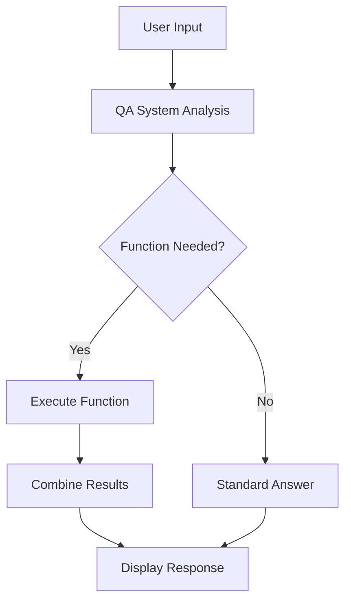
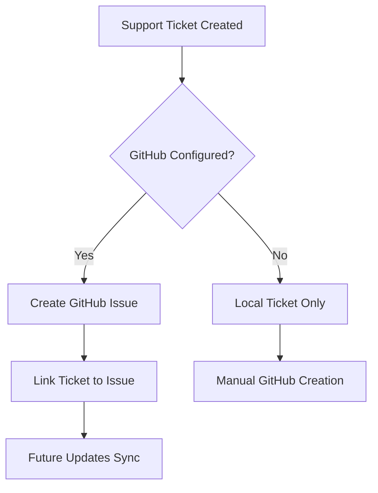

# 🤖 AI-Powered Support Bot

An intelligent support chatbot with function calling capabilities and GitHub Issues integration. This bot can answer questions from documentation, create support tickets, and automatically manage GitHub issues.


## ✨ Features

### 🧠 **Intelligent Q&A System**
- AI-powered responses using OpenAI GPT models
- Document search and retrieval
- Fallback to simple keyword matching
- Source citation and reference tracking

### 🔧 **Function Calling**
- Automatic detection of user intent
- Smart action triggering based on conversation context
- 6 built-in functions for common support tasks
- Extensible function registry system

### 🎫 **Support Ticket Management**
- Create tickets directly through conversation
- Priority levels (low, medium, high, urgent)
- Ticket status tracking and updates
- Escalation workflows

### 🔗 **GitHub Issues Integration**
- Automatic GitHub issue creation from tickets
- Bidirectional synchronization
- Escalation comments and updates
- Issue tracking with direct links

### 💬 **User-Friendly Interface**
- Clean Streamlit web interface
- Real-time conversation history
- System status monitoring
- Configuration testing and setup guides

## 🚀 Quick Start

### Prerequisites
- Python 3.8+
- OpenAI API key
- GitHub repository (optional, for issue tracking)

### Installation

1. **Clone or download the project**
   ```bash
   # Create a new directory
   mkdir support-bot
   cd support-bot
   ```

2. **Install dependencies**
   ```bash
   pip install streamlit openai python-dotenv requests
   ```

3. **Create the main application file**
   - Save the provided code as `app.py`

4. **Set up environment variables**
   ```bash
   # Create .env file
   touch .env
   ```

5. **Configure your API keys** (see Configuration section below)

6. **Run the application**
   ```bash
   streamlit run app.py
   ```

The application will open in your browser at `http://localhost:8501`

## ⚙️ Configuration

### Required Configuration

Create a `.env` file in your project root:

```env
# Required for AI functionality
OPENAI_API_KEY=your_openai_api_key_here
```

### Optional GitHub Integration

Add these to your `.env` file for GitHub Issues integration:

```env
# GitHub Issues Integration (Optional)
GITHUB_TOKEN=your_github_personal_access_token
GITHUB_REPO_OWNER=your_github_username_or_org
GITHUB_REPO_NAME=your_repository_name
```

### Getting API Keys

#### OpenAI API Key
1. Visit [OpenAI Platform](https://platform.openai.com/api-keys)
2. Sign in or create an account
3. Click "Create new secret key"
4. Copy the key and add it to your `.env` file
5. **Important**: Keep your API key secure and never commit it to version control

#### GitHub Personal Access Token
1. Go to GitHub → Settings → Developer settings → [Personal access tokens](https://github.com/settings/tokens)
2. Click "Generate new token (classic)"
3. Give it a descriptive name: "Support Bot Integration"
4. Select the following scopes:
   - ✅ `repo` (for private repositories)
   - ✅ `public_repo` (for public repositories)
   - ✅ `write:discussion` (optional, for team discussions)
5. Click "Generate token"
6. Copy the token immediately (you won't see it again!)

## 🎯 How It Works

### Automatic Function Detection

The bot intelligently detects when to call functions based on user input:

| User Input | Triggered Function | Result |
|------------|-------------------|---------|
| "I can't log in" | `create_support_ticket` | Creates ticket + GitHub issue |
| "How do I reset password?" | `search_documentation` | Searches docs for answer |
| "Check ticket TICK-12345" | `get_ticket_status` | Shows ticket details |
| "What's the system status?" | `get_system_status` | Displays system health |
| "Show my tickets" | `list_user_tickets` | Lists user's tickets |

### Function Calling Flow



### GitHub Integration Workflow



## 🔧 Available Functions

### 1. `create_support_ticket`
**Purpose**: Create support tickets for issues requiring human attention

**Triggers**:
- "Create a ticket"
- "I need help"
- "Contact support"
- Uncertain bot responses

**Parameters**:
- `summary`: Brief issue description
- `description`: Detailed problem description
- `priority`: low, medium, high, urgent

### 2. `search_documentation`
**Purpose**: Search through product documentation

**Triggers**:
- "Search for..."
- "Find information about..."
- "Look up..."

**Parameters**:
- `query`: Search terms
- `max_results`: Number of results (default: 5)

### 3. `get_system_status`
**Purpose**: Check system health and configuration

**Triggers**:
- "System status"
- "Is everything working?"
- "Health check"

### 4. `get_ticket_status`
**Purpose**: Check status of specific ticket

**Triggers**:
- "Check ticket TICK-12345"
- "Ticket status"

**Parameters**:
- `ticket_id`: Ticket identifier

### 5. `list_user_tickets`
**Purpose**: List all tickets for current user

**Triggers**:
- "My tickets"
- "Show tickets"
- "List tickets"

**Parameters**:
- `status_filter`: all, open, closed, pending

### 6. `escalate_ticket`
**Purpose**: Escalate ticket priority

**Triggers**:
- "Escalate ticket"
- Automatic escalation logic

**Parameters**:
- `ticket_id`: Ticket to escalate
- `reason`: Escalation reason

## 📁 Project Structure

```
support-bot/
├── app.py                 # Main application (single file)
├── .env                   # Environment variables
├── .env.example          # Example environment file
├── README.md             # This file
├── requirements.txt      # Python dependencies
├── .gitignore           # Git ignore rules
└── data/                # Documentation files (optional)
    ├── user_guide.pdf
    ├── api_docs.pdf
    └── faq.pdf
```

## 🛠️ Development Setup

### For Contributors

1. **Clone the repository**
   ```bash
   git clone <repository-url>
   cd support-bot
   ```

2. **Create virtual environment**
   ```bash
   python -m venv venv
   source venv/bin/activate  # On Windows: venv\Scripts\activate
   ```

3. **Install dependencies**
   ```bash
   pip install -r requirements.txt
   ```

4. **Copy environment template**
   ```bash
   cp .env.example .env
   # Edit .env with your API keys
   ```

5. **Run in development mode**
   ```bash
   streamlit run app.py --server.runOnSave true
   ```

### Requirements.txt

Create a `requirements.txt` file:

```txt
streamlit>=1.28.0
openai>=1.0.0
python-dotenv>=1.0.0
requests>=2.31.0
```

### .env.example

Create a `.env.example` file:

```env
# Required Configuration
OPENAI_API_KEY=your_openai_api_key_here

# Optional GitHub Integration
GITHUB_TOKEN=your_github_personal_access_token
GITHUB_REPO_OWNER=your_github_username
GITHUB_REPO_NAME=your_repository_name

# Optional Model Configuration
MODEL_NAME=gpt-3.5-turbo
TEMPERATURE=0.1
MAX_TOKENS=500
```

### .gitignore

Create a `.gitignore` file:

```gitignore
# Environment variables
.env

# Python
__pycache__/
*.py[cod]
*$py.class
*.so
.Python
build/
develop-eggs/
dist/
downloads/
eggs/
.eggs/
lib/
lib64/
parts/
sdist/
var/
wheels/
*.egg-info/
.installed.cfg
*.egg

# Streamlit
.streamlit/

# Logs
*.log

# IDE
.vscode/
.idea/
*.swp
*.swo

# OS
.DS_Store
Thumbs.db
```

## 🎯 Usage Examples

### Basic Q&A
```
User: "How do I reset my password?"
Bot: "Based on the documentation: To reset your password, go to the login page and click 'Forgot Password'..."
```

### Automatic Ticket Creation
```
User: "I'm having trouble with billing and can't figure it out"
Bot: "I understand you're having billing issues. Let me search the documentation and create a support ticket for you.

🎫 I've created support ticket TICK-A1B2C3D4 for you.
🔗 GitHub issue #123 also created.
📋 View at: https://github.com/username/repo/issues/123"
```

### System Status Check
```
User: "Is everything working?"
Bot: "🔍 System Status:
• QA System: online
• OpenAI: connected  
• Documents: 4 loaded
• GitHub: enabled
• Active Tickets: 2"
```

### Ticket Management
```
User: "Check my tickets"
Bot: "🎫 Your Support Tickets (2 total):
• TICK-A1B2C3D4: Login issues (open) - Priority: medium
• TICK-E5F6G7H8: Billing question (closed) - Priority: low"
```

## 🔒 Security Considerations

### API Key Security
- ✅ Never commit API keys to version control
- ✅ Use environment variables or secure secret management
- ✅ Rotate API keys regularly
- ✅ Set usage limits in OpenAI dashboard
- ✅ Monitor API usage and costs

### GitHub Token Security
- ✅ Use minimum required permissions
- ✅ Set token expiration dates
- ✅ Regularly audit repository access
- ✅ Revoke unused tokens

### Data Privacy
- ✅ User data is stored in session state (not persistent)
- ✅ No sensitive data logged
- ✅ GitHub issues are created in your controlled repository
- ✅ OpenAI API calls follow their data usage policies

## 🚀 Deployment

### Streamlit Cloud

1. **Push code to GitHub**
   ```bash
   git add .
   git commit -m "Initial support bot setup"
   git push origin main
   ```

2. **Deploy to Streamlit Cloud**
   - Visit [share.streamlit.io](https://share.streamlit.io)
   - Connect your GitHub repository
   - Set environment variables in the Streamlit dashboard
   - Deploy!

3. **Configure secrets in Streamlit Cloud**
   - Go to your app settings
   - Add secrets:
     ```toml
     OPENAI_API_KEY = "your_key_here"
     GITHUB_TOKEN = "your_token_here"
     GITHUB_REPO_OWNER = "your_username"
     GITHUB_REPO_NAME = "your_repo"
     ```

### Docker Deployment

Create a `Dockerfile`:

```dockerfile
FROM python:3.9-slim

WORKDIR /app

COPY requirements.txt .
RUN pip install -r requirements.txt

COPY app.py .
COPY .env .

EXPOSE 8501

CMD ["streamlit", "run", "app.py", "--server.address", "0.0.0.0"]
```

Build and run:
```bash
docker build -t support-bot .
docker run -p 8501:8501 support-bot
```

## 🧪 Testing

### Configuration Test
Use the built-in configuration tester:
1. Run the app
2. Click "🧪 Test Configuration" in the sidebar
3. Verify all components are working

### Manual Testing Checklist

- [ ] App loads without errors
- [ ] Can ask basic questions
- [ ] Ticket creation works
- [ ] GitHub issues are created (if configured)
- [ ] System status displays correctly
- [ ] User information persists in session
- [ ] Function calling triggers appropriately

### Test Scenarios

```python
# Test basic Q&A
"How do I reset my password?"

# Test ticket creation
"I need help with my account"

# Test documentation search  
"Search for API documentation"

# Test system status
"What's the system status?"

# Test ticket management
"Show me my tickets"
"Check ticket TICK-12345678"
```

## 🐛 Troubleshooting

### Common Issues

#### Empty Page / App Won't Load
- **Cause**: `set_page_config()` called multiple times
- **Solution**: Ensure it's only called once at the top of the file

#### OpenAI API Errors
- **Cause**: Missing or invalid API key
- **Solution**: Check `.env` file and API key validity
- **Test**: Use the built-in configuration tester

#### GitHub Integration Not Working
- **Cause**: Missing token or incorrect repository settings
- **Solution**: Verify GitHub token has correct permissions
- **Check**: Repository exists and token has access

#### Function Calling Not Triggering
- **Cause**: OpenAI connection issues or trigger phrase not recognized
- **Solution**: Check OpenAI connection, try explicit trigger phrases

### Debug Mode

The app includes built-in debugging:
1. Check the sidebar for system status indicators
2. Use "🧪 Test Configuration" to verify setup
3. Check the function calls log for recent activity
4. Review conversation history for error patterns

### Logging

View logs for detailed error information:
```python
import logging
logging.basicConfig(level=logging.DEBUG)
```

## 🔧 Customization

### Adding New Functions

1. **Define the function** in `FunctionRegistry`:
   ```python
   def my_custom_function(self, param1: str, param2: int) -> Dict:
       # Your function logic here
       return {"success": True, "message": "Function executed"}
   ```

2. **Add to function registry**:
   ```python
   self.functions["my_custom_function"] = self.my_custom_function
   ```

3. **Add trigger detection** in `_analyze_for_function_call`:
   ```python
   if "trigger phrase" in question_lower:
       return {
           "name": "my_custom_function",
           "parameters": {"param1": "value", "param2": 123}
       }
   ```

### Customizing Documentation

Replace the sample documents in `SimpleDocumentProcessor.load_documents()` with your actual documentation:

```python
self.documents = [
    {
        "content": "Your actual documentation content...",
        "metadata": {"source": "your_doc.pdf", "page": 1}
    },
    # Add more documents...
]
```

### Modifying UI

The Streamlit interface can be customized:
- Update page title and icon in `st.set_page_config()`
- Modify sidebar layout in `display_sidebar()`
- Change chat display in `display_chat_history()`
- Add custom CSS with `st.markdown()` and `unsafe_allow_html=True`

## 📊 Monitoring and Analytics

### Built-in Metrics
- Document count
- Total tickets created
- Function calls made
- System health status

### Adding Custom Analytics

```python
# Track user interactions
if "analytics" not in st.session_state:
    st.session_state.analytics = {
        "questions_asked": 0,
        "tickets_created": 0,
        "functions_called": {}
    }

# Increment counters
st.session_state.analytics["questions_asked"] += 1
```

### Integration with External Analytics

Consider integrating with:
- Google Analytics
- Mixpanel
- Custom logging systems
- Database storage for persistent metrics

## 🔄 Advanced Features

### Adding Database Persistence

Replace session state with database storage:

```python
import sqlite3
# or
import postgresql
# or 
import mongodb
```

### Enhanced AI Models

Upgrade to more powerful models:
- GPT-4 for better reasoning
- Custom fine-tuned models
- Local LLMs for privacy

### Multi-language Support

Add internationalization:
- Streamlit's built-in i18n support
- Translation APIs
- Language detection

### Voice Interface

Add voice capabilities:
- Speech-to-text for input
- Text-to-speech for responses
- WebRTC for real-time audio

## 📚 API Reference

### Core Classes

#### `SupportBotApp`
Main application class that orchestrates all components.

#### `FunctionRegistry` 
Manages available functions and their execution.

#### `EnhancedQASystem`
Handles question answering with function calling capabilities.

#### `GitHubIssuesIntegration`
Manages GitHub Issues API interactions.

#### `TicketSystem`
Handles support ticket lifecycle management.

### Environment Variables

| Variable | Required | Description | Example |
|----------|----------|-------------|---------|
| `OPENAI_API_KEY` | Yes | OpenAI API key for AI functionality | `sk-...` |
| `GITHUB_TOKEN` | No | GitHub personal access token | `ghp_...` |
| `GITHUB_REPO_OWNER` | No | GitHub username or organization | `myusername` |
| `GITHUB_REPO_NAME` | No | Repository name for issues | `support-tickets` |
| `MODEL_NAME` | No | OpenAI model to use | `gpt-3.5-turbo` |
| `TEMPERATURE` | No | AI response creativity (0-1) | `0.1` |
| `MAX_TOKENS` | No | Maximum response length | `500` |

## 🤝 Contributing

### How to Contribute

1. **Fork the repository**
2. **Create a feature branch**
   ```bash
   git checkout -b feature/your-feature-name
   ```
3. **Make your changes**
4. **Add tests** for new functionality
5. **Submit a pull request**

### Code Standards

- Follow PEP 8 style guidelines
- Add type hints for function parameters
- Include docstrings for all classes and methods
- Add error handling for external API calls
- Write tests for new functions

### Feature Requests

- Use GitHub Issues to request new features
- Provide detailed use cases and examples
- Consider backward compatibility

## 📄 License

This project is licensed under the MIT License - see the [LICENSE](LICENSE) file for details.

## 🙏 Acknowledgments

- **OpenAI** for providing the GPT models
- **Streamlit** for the excellent web framework
- **GitHub** for the Issues API
- **Community** for feedback and contributions

## 📞 Support

Need help with the Support Bot?

- **Documentation Issues**: Create a GitHub issue
- **Configuration Help**: Check the troubleshooting section
- **Feature Requests**: Open a GitHub issue with the "enhancement" label
- **Bug Reports**: Provide detailed reproduction steps in a GitHub issue

---

**Made with ❤️ and 🤖 AI**

*Happy to help automate your support workflows!*